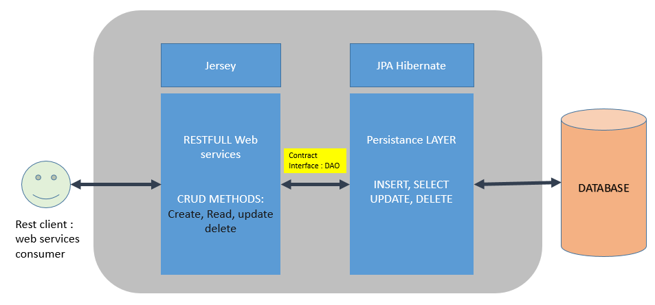
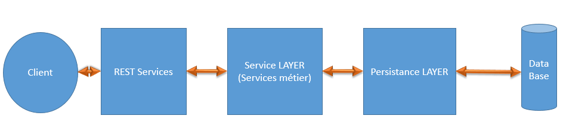
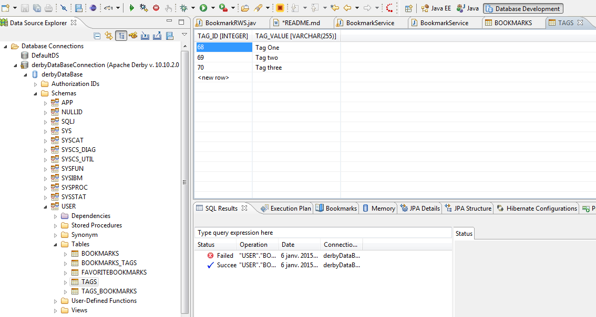
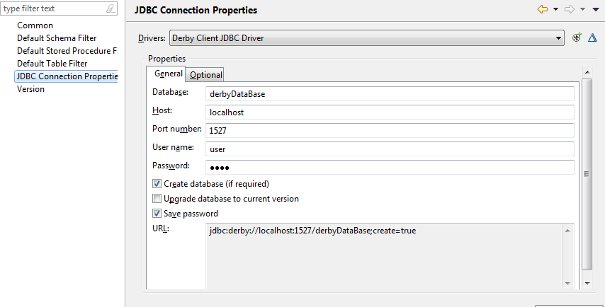
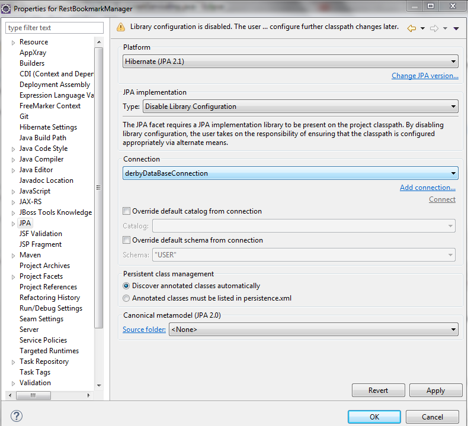

#Objectifs: 

* Concepts JEE abordés: JPA, DAO Factory, Hibernate, Maven, Jersey, Glassfish
* Implémenter les patterns DAO avec le pattern Factory	
* Implémenter la couche JPA (persistance des données)
* Relier la base de données MYSQL avec les classes (POJO) à l'aide de DAO (DATA Access Object):  Objets	 d'accès à la base de données
* Familiarisation avec la librairie JERSEY pour exposer des services RESTful.

###Architecture générale (processus) de persistance:
* JPA REST ARCHITECTURE:
 
* PERSISTENCE SERVICES REST DATABASE CLIENT ARCHITECTURE



##### NOTES & REMARQUES:
* Pattern factory= fabrique d'objets; délègue l'instanciation d'obejts à une classe
* Avantages = instance concrètes(avec new) se font à une seul endroit => s'il y a des changements à faire, se feront
		à un seul endroit
* Le pattern Factory dans DAO sert à créer les instances d'accès aux données
* Le DAO Factory crée une instance De genericDAO.java pour retourner l'objet DAO souhaité.
* Plus d'infos sur l'imp de DAO : http://openclassrooms.com/courses/apprenez-a-programmer-en-java/lier-ses-tables-avec-des-objets-java-le-pattern-dao
```sh
/**
 *
 * @author Housssam
 * @version 1 déc. 2014
 * DAO objects factory
 */
public class DAOFactory {	
	protected static EntityManagerFactory emf=Persistence.createEntityManagerFactory("bookmarkpersistence");
	protected static EntityManager em=emf.createEntityManager();	
	/**
	 * CONSTRUCTOR
	 */
	public DAOFactory() {}
	/**
	 * MANUFACTORING BOOKMARK DAO
	 * @return
	 */
	public static InterfaceDAO<Bookmark> getBookMarkDAO(){
		return new BookmarkDAO(em);
	}
	/**
	 * MANUFACTORING TAG DAO
	 * @return
	 */	
	public static InterfaceDAO<Tag> getTagDAO(){
		return new TagDAO(em);
	}	
```


##COUCHE REST 


* fichier applicationContext.xml :
```sh
<!-- Directory scanning for controllers -->
<context:annotation-config />
<context:component-scan base-package="fr.tp.bookmarkmanager" />
<tx:annotation-driven transaction-manager="transactionManager" />

<!-- Inject helloService to HelloWorldRWS -->
<bean id="helloService" class="fr.tp.bookmarkmanager.services.imp.HelloWorldServiceImp">
</bean>
<bean name="helloworld" class="fr.tp.bookmarkmanager.rest.HelloWorldRWS">
		<property name="helloservice" ref="helloService" />
</bean>
<!-- Inject BookmarkService to BookmarkRWS -->
<bean id="bookmarkService" class="fr.tp.bookmarkmanager.services.imp.BookmarkServiceImp">
</bean>
<bean name="bookmarkRWS" class="fr.tp.bookmarkmanager.rest.BookmarkRWS">
		<property name="bookmarkservice" ref="bookmarkService"></property>
</bean>
<!-- Inject TagService to TagRWS -->
<bean id="tagService" class="fr.tp.bookmarkmanager.services.imp.TagServiceImp"></bean>
	<bean name="tagRWS" class="fr.tp.bookmarkmanager.rest.TagRWS">
		<property name="tagServiceInt" ref="tagService"></property>
</bean>
```	
		
* FactoryBean crée les JPA EntityManagerFactory
* EntityManagerFactory peuvent être passés à JPA-Based DAO via les injection de dépendance:
* La proprieté "persistentXmlLocation" spécifie la localisation du fichier configurant la couche de  persistence JPA(persistence.xml)
* jpaVendorAdapter (HibernateJpaVendorAdapter) spécifie le type de connecteur de base de données utilisé.

```sh

protected static EntityManagerFactory 	emf=Persistence.createEntityManagerFactory("bookmarkpersistence");
protected static EntityManager em=emf.createEntityManager();	

```
	 			

## La couche de persistence JPA 
* Le contrat entre la couche des services et la couche des de persistence se
	  fait via l'interface DAO; en l'occurence : FactoryDAO.java :)
* Dans le fichier BookMarkDAO.java, on utilise un objet EntityManger, chargé de : API EntityManager  est utilisé pour accéder à une base de données dans une unité de travail particulière . 
		Il est utilisé pour créer et supprimer des instances d'entités persistantes , 
		de trouver entités par leur identité de clé primaire
		et d'interroger sur toutes les entités . Cette interface est similaire à la session dans Hibernate.

####CONFIGURATION DE LA COUCHE PERSISTANCE : persistence.xml

```sh
<?xml version="1.0" encoding="UTF-8"?>
<persistence xmlns="http://java.sun.com/xml/ns/persistence"
	xmlns:xsi="http://www.w3.org/2001/XMLSchema-instance"
	xsi:schemaLocation="http://java.sun.com/xml/ns/persistence http://java.sun.com/xml/ns/persistence/persistence_1_0.xsd"
	version="1.0">
	<persistence-unit name="bookmarkpersistence" transaction-type="RESOURCE_LOCAL">		
		<provider>org.hibernate.ejb.HibernatePersistence</provider>
		<class>fr.tp.bookmarkmanager.entities.Bookmark</class>
		<class>fr.tp.bookmarkmanager.entities.PinnedBookmark</class>
		<class>fr.tp.bookmarkmanager.entities.Tag</class>
		<!-- <mapping-file>META-INF/orm.xml</mapping-file> -->
		<exclude-unlisted-classes>false</exclude-unlisted-classes>
		<properties>
			<property name="javax.persistence.jdbc.url"
				value="jdbc:derby://localhost:1527/derbyDataBase;create=true" />
			<property name="javax.persistence.jdbc.driver" value="org.apache.derby.jdbc.EmbeddedDriver" />
			<property name="javax.persistence.jdbc.user" value="user" />
			<property name="javax.persistence.jdbc.password" value="user" />
			<property name="hibernate.hbm2ddl.auto" value="update" />
			<property name="hibernate.show_sql" value="true" />
			<property name="hibernate.format_sql" value="true" />
			<property name="hibernate.dialect" value="org.hibernate.dialect.DerbyDialect" />
			<property name="hibernate.transaction.manager_lookup_class"
				value="org.hibernate.transaction.SunONETransactionManagerLookup" />
			<property name="hibernate.archive.autodetection" value="class, hbm" />
		</properties>
	</persistence-unit>
</persistence>
```
**Le context de peristence** :
	 	Un contexte de persistance est un ensemble d'instances dans lequel, pour ne importe  	quelle identité d'une entité persistante il ya une instance d'entité unique. Dans le  	contexte de persistance , les instances d'entités et de leur cycle de vie est géré par 	un gestionnaire d'entités particulier. La portée de ce contexte peut être la transsaction
* Pour insérer une entité dans une BD; on peut soit utiliser la méthode persist() ou merge().
	 
# Création de la base de données et génération des entities:
* Démarrer glassfish database avec la commande: asadmin start-database
* Ajout le perspective "database developpement" à la fenêtre d'eclipse 
		-> OpenPerspective > Other > Database Developement
* Création d'une connection à la base de données: clique droit sur Database connections > New
 
* Créer une BD en choisissant le "profile" Derby, donner un nom à la base de données et choisir le mot
		de mot de passe, nom utilisateur et le port.
 
* Une fois la connection et la DB créée, démarrer là en y cliquant droit > connect.
* Dans le fichier hibernate.cfg.xml, ajouter la ligne définissant la propriété connection 	d'hibernate:	
 
```sh
<hibernate-configuration>  
  <session-factory>  
    <property name="hibernate.connection.driver_class">org.apache.derby.jdbc.ClientDriver</property>     
    <property name="hibernate.dialect">org.hibernate.dialect.DerbyDialect</property>    
    <property name="hibernate.connection.url"> jdbc:derby://localhost:1527/derbyDataBase;create=true</property>
    <property name="hibernate.connection.username">user</property>
    <property name="hibernate.connection.password">user</property>
    <property name="hibernate.hbm2ddl.auto">create</property>
    <property name="hibernate.show_sql">true</property>
    <property name="hibernate.format_sql">true</property>      
  </session-factory>  
</hibernate-configuration> 
```		  	
	

##### Changer les propriétés du projet, i-e les propriétés jpa et hiberante et Ajout de la facet JPA au projet afin que l'on puisse distinguer les entités et le mappage effectué.
* Clique droit sur le projet > propriétés > facets : sélectionner JPA et choisissez la bonne version.	 
* Cela ajoute un nouvelle "facet" à votre projet : "JPA Content".
* Dérouler ce projet vous listera les différentes entités scannées que le moteur JPA a trouvé dans le projet.
  
 
###### Déclarer les entités dans le fichier persistence.xml: 
	
* Clique droit sur JPA Content > persistence, puis clique sur "Synchronise Class List": cela rajoute automatiquement les différentes classes Entity dans le fichier "persistence.xml".
```sh
		<class>fr.tp.bookmarkmanager.entities.Bookmark</class>
		<class>fr.tp.bookmarkmanager.entities.PinnedBookmark</class>
		<class>fr.tp.bookmarkmanager.entities.Tag</class>
```		
		
**Remarques :**  

* Sur des grands projets la déclaration de toutes les classes peut surcharger le fichier 	persistence.xml; pour remédier à cela on peut envisager l'utilisation d'un fichier orm.xml où 	l'on	déclarera toutes les entités. Ce fichier sera par la suite importé dans le fichier 	persistence.xml.
* ERROR: L'ajout des annotations @Transaction et @PersistentContext aux opérations des 	services(@Service) 	suppose l'utilisation	des transaction de type "JTA" au lieu de "RESOURCE_LOCAL" ( 	à déclarer dans 	persistence.xml :  	transaction-type="JTA".
	
* ERROR :  Constraints 'X' and 'Y' have the same set of columns, which is not allowed. Cette vient du   fait que la clé primary spécifiée dans Pojo contient des déclarations de contraintes qu'il ne faut pas utilisé: voici un exemple illustrant cette situation:
```sh
@Entity
@Table(name="BOOKMARKS")
public class Bookmark implements Serializable{	
	private static final long serialVersionUID = -1L;
	@Id
	@GeneratedValue(strategy=GenerationType.AUTO)
	@Column(name="bm_id")
	private Integer id;	
	@Column(name="bm_name", nullable = false)
	@Size(max = 40)
	private String name;
	@Column(name="bm_type",nullable = false)
	@Size(max = 60)
	private String type;
	@Column(name="bm_description", nullable=true, length=66)
	private String description;	
	@OneToMany
	private Collection<Tag> tags;
```	
* @GeneratedValue & @Id suffisent pour faire comprendre à hibernate qu'il s'agit d'une clé primaire.

Les Services REST avec JERSEY  
-------------------------------------
* Au sein des objets REST, i-e les objets exposants les données comme web services;
  on aura seulement besoin d'une interface @Service sur laquelle on appelera les méthodes voulues, 
  par ex: create(), delete() ...Etc;

* Exemple d'interfaces:
```sh
  public interface BookmarkServiceInt {	
		Integer createBookmark(final Bookmark instance);
		List<Bookmark> getAllBookmarks();
		Integer deleteAllBookmarks();
		Bookmark getBookmarkByID(Integer id);
		void deleteByID(Integer id);	
  }  
```

```sh
@Service
public class BookmarkServiceImp implements BookmarkServiceInt{
	InterfaceDAO<Bookmark> bm_dao =DAOFactory.getBookMarkDAO();
	/**
	 * CREATE BOOKMARK
	 * {@inheritDoc}
	 */	
	public Integer createBookmark(Bookmark instance) {		
		return bm_dao.create(instance);		
	}
	/**
	 * GET ALL BOOKMARKS
	 * {@inheritDoc}
	 */	
	public List<Bookmark> getAllBookmarks() {
		return bm_dao.getAll();
	}
	/**
	 * DELETE ALL BOOKMARKS
	 * {@inheritDoc}
	 * @return 
	 */	
	public Integer deleteAllBookmarks() {
		return bm_dao.deleteAll();
	}
	....
}
```
	  
* Combiner les services à la couche REST : créant ici nos web services : exemple BookmarkRWS.java.
```sh
@Path("/bookmarks")
public class BookmarkRWS {
	private BookmarkServiceInt bookmarkservice;	
	public BookmarkRWS() {}
	/**
	 * add bookmark
	 * @return
	 */
	@GET
	@Path("/add")
	public Response addBookmark(){
		Collection<Tag> tags=null;
		Bookmark bm=new Bookmark("Added_BM", "A", "Favorite A",tags);
		bookmarkservice.createBookmark(bm);			
		return Response.ok(bm, MediaType.APPLICATION_JSON).build();
	}
	/**
	 * Creation bookmark
	 * @param bookmark
	 * @return
	 */
	@POST
	@Path("/add")
	@Produces({ MediaType.APPLICATION_JSON })
	public Response createBookMark(
			@QueryParam("name")String name,
			@QueryParam("type")String type,	
			@QueryParam("description")String description){
		Bookmark bm=new Bookmark(name, type, description);
		int id=bookmarkservice.createBookmark(bm);
		return Response.status(200).entity("Un nouveau BookMark vient d'être créé dont le id ="+id)
				.header("Access-Control-Allow-Origin", "*")
				.header("Access-Control-Allow-Methods", "POST, DELETE, GET, PUT").build();
	}	
	@GET
	@Path("/getAll")
	@Produces({MediaType.APPLICATION_JSON, MediaType.APPLICATION_XML})
	public Response getAllBookmarks() throws IOException, ApplicationException{
		List<Bookmark> bms = bookmarkservice.getAllBookmarks();
		return Response.ok(bms)
				.header("Access-Control-Allow-Origin", "*")
				.header("Access-Control-Allow-Methods", "GET, POST, DELETE, PUT")
				.build();
	}	
		/**
	 * Delete BOOKMARK BY ID
	 * @param id
	 * @return
	 */
	@DELETE
	@Path("/delete/{id}")
	@Produces({MediaType.TEXT_PLAIN})
	public Response deleteBookMarkByID(@PathParam("id") Integer id){
		try{
			bookmarkservice.deleteByID(id);		
		}catch(Exception e){
			e.printStackTrace();			
		}
		return Response.status(200).entity("Bookmark deleted.")
				.header("Access-Control-Allow-Origin", "*")
				.header("Access-Control-Allow-Methods", " DELETE, PUT").build();
	}	
	/**
	 * DELETE ALL BOOKMARKS
	 * @return
	 */
	@DELETE
	@Path("/delete/all")
	@Produces({MediaType.TEXT_PLAIN})
	public Response deleteAllBookMarks(){
		int nb_deleted=bookmarkservice.deleteAllBookmarks();
		System.out.println("nb :"+nb_deleted);
		return Response.ok(nb_deleted + " bookmarks deleted. ")
				.header("Access-Control-Allow-Origin", "*")
				.header("Access-Control-Allow-Headers", "Content-Type")
				.header("Access-Control-Allow-Methods", "DELETE, GET, POST,  PUT").build();
	}	
```
- Faut pas oublier de créer un setter pour le bean injecté (fichier applicationContext.xml de spring):
```sh
	/** ---------------------------------- Beans Setters ------------------------------- */
	/**
	 * @param bookmarkservice the bookmarkservice to set
	 */
	@Autowired
	public void setBookmarkservice(BookmarkServiceInt bookmarkservice) {
		this.bookmarkservice = bookmarkservice;
	}
```  			
###Remarques et erreurs: 

* Dans le fichier web.xml: l'erreur "java.lang.ClassNotFoundException: 		org.glassfish.jersey.servlet.ServletContainer" vient du fait   que la version de jersey que vous utilisez n'est pas celle qu'il faut déclarer dans dans web.xml:
faut remplacer : " org.glassfish.jersey.servlet.ServletContainer " de la version 2 PAR :
la version 1 : " com.sun.jersey.spi.container.servlet.ServletContainer" .
		
* Si glassfish ne démarre pas ou qu'il est bloqué sur "65%", je recommande la suppression du répertoire	osgi-cache du domaine glassfish utilisé.
	
	

Copyright : Houssam KOURDACHE [Cybercratos]
[Cybercratos]:http://cybercratos.com
